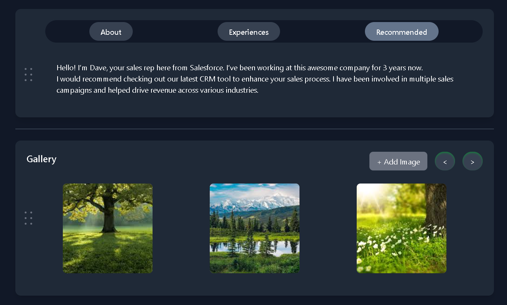

# Responsive Tab and Gallery Component

This project is a responsive web page that includes two main components: a **TabsComponent** and a **GalleryComponent**. It is built using **React** and **Tailwind CSS**. The components are fully responsive and feature animations for smooth transitions and interactions.

## Features

1. **TabsComponent**:
   - A tabbed interface with three sections: "About Me", "Experiences", and "Recommended".
   - Animated button-like transitions when switching between tabs.
   - Responsive design for all devices.

2. **GalleryComponent**:
   - A gallery of images that can be navigated using left and right buttons.
   - Animated scaling when hovering over images.
   - Responsive design that adapts to different screen sizes.

## Installation and Usage

1. Clone the repository:

    ```bash
    git clone https://github.com/User-dashboard.git
    ```

2. Install dependencies:

    ```bash
    npm install
    ```

3. Start the development server:

    ```bash
    npm start
    ```

4. Open the app in your browser at `http://localhost:3000`.

## Demo

Below is a preview of the app's user interface:



## Technologies Used

- React
- Tailwind CSS
- Framer Motion (for animations)

## Folder Structure

```bash
├── public
│   └── index.html
├── src
│   ├── components
│   │   ├── TabsComponent.jsx
│   │   ├── GalleryComponent.jsx
│   └── App.jsx
├── README.md
├── .gitignore
├── package.json
└── tailwind.config.js
